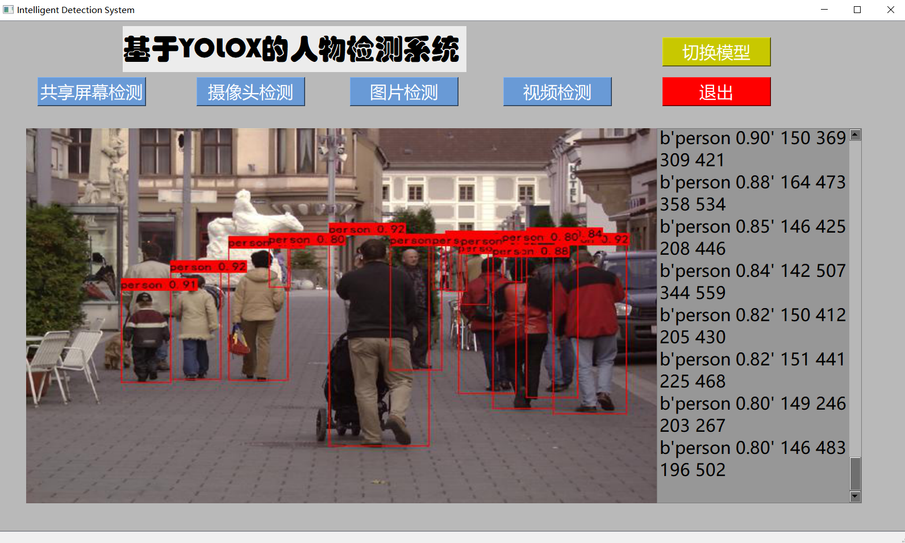

# Pedestrain/Character Detection System Based on YoloX

基于YOLOX的人物检查系统

How to run:(python >= 3.10.4)
```bash    
$ git clone https://github.com/ksdfhaksfhgkajh/Genshin-Characters-and-Monsters-Idetifications.git
$ pip install -r requirements.txt
$ python predict.py
```
Click ***"切换模型"*** button to switch the detecting targets: **Pedestrain/Game_Character** (Pedestrain by default)

Several functions are provided, which can be used to detect targets on the screen, camera, picture or video.
- **屏幕检测**
- **摄像头检测**
- **图片检测**
- **视频检测**


